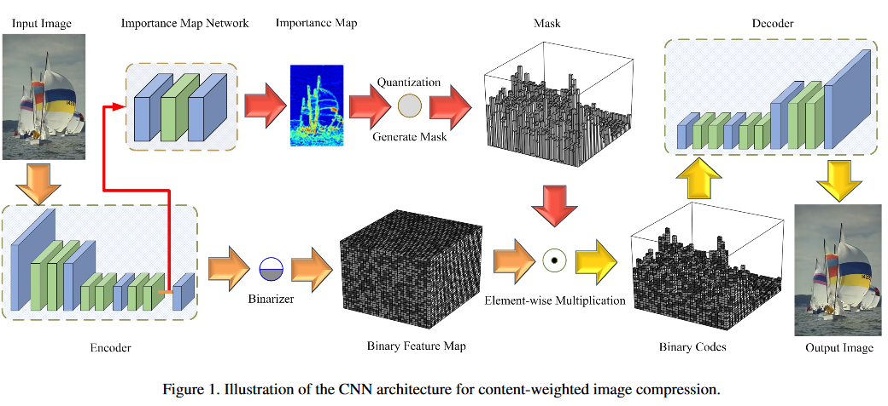
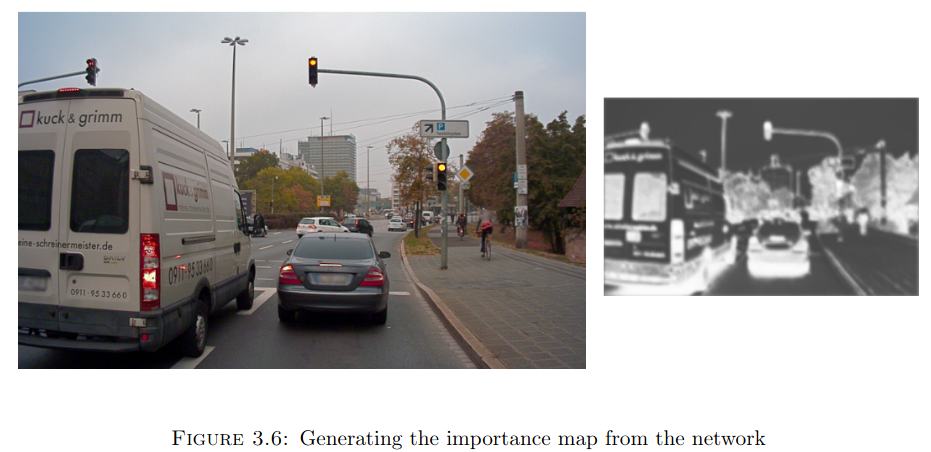

# Learning Convolutional Networks for Content-Weighted Image Compression

## About

This repository defines a model for learnable image compression based on the 2018 CVPR paper ["Learning Convolutional Networks for Content-Weighted Image Compression by Mu Li et. al.](https://openaccess.thecvf.com/content_cvpr_2018/papers/Li_Learning_Convolutional_Networks_CVPR_2018_paper.pdf). I used this as a baseline model while working on my bachelor thesis. For any doubts please feel free to write to me.

## Architecture



As illustrated in the figure above, the content-weighted image compression framework is composed of four components,
i.e. convolutional encoder, binarizer, importance map network, and convolutional decoder. Given an input image x

1. the convolutional encoder defines a nonlinear analysis transformation by stacking convolution layers, outputs E(x)
2. The binarizer B(E(x)) sets the encoder features with sigmoid output higher than 0.5 to 1, and others to 0
3. The importance map network takes the intermediate feature maps of the encoder as input, and yields the content-weighted importance map P(x)
4. A rounding function is adopted to quantize P(x), and then a mask M(P(x)) which has the same size as B(E(x)) is generated with the guidance of the quantized P(x)
5. The binary code B(E(x)) is then element-wise mutiplied with M(P(x)) to get the trimmed binary codes
6. Finally, the decoder defines a nonlinear synthesis transformation to produce the reconstructed image $\hat{x}$

## Dependencies

- PyTorch
- PyTorch Lightning
- PIL

## Training your own model

The model is trained in 2 steps

1. Train the model without using the importance map branch. 
2. Introduce the importance map branch in the pre-trained model and fine-tune.

To train the model, you need to supply it with a dataset of high quality RGB images and a set of validation images to track the reconstruction.
The data is read through a glob pattern which must expand to a list of RGB images in PNG format.
Training can be as simple as the following command:

### Stage 1 : Training the Main Branch

````bash
python train.py --verbose train --train_glob="train_images/*.png" --valid_glob="valid_images/*.png"
````
The number of epochs to train the main branch for depends on the size of your dataset. While using Cityscapes, which has a training size of 2,975, the model was trained with a batch size of 64 for 1200 epochs. This will train the model without the importance map after which you must use the importance map branch and train for a few more epochs with a reduced learning rate.

### Stage 2 : Training the Importance Map

To be added soon.

### Results

The importance map that my network learnt to generate on [A2D2](https://www.a2d2.audi/a2d2/en.html) after being trained on Cityscapes. You can read more about my experiments in my bachelor thesis, the link to which is available on my homepage.



## Citation

Please cite the original paper if you use this work.

````bash
@InProceedings{Li_2018_CVPR,
author = {Li, Mu and Zuo, Wangmeng and Gu, Shuhang and Zhao, Debin and Zhang, David},
title = {Learning Convolutional Networks for Content-Weighted Image Compression},
booktitle = {Proceedings of the IEEE Conference on Computer Vision and Pattern Recognition (CVPR)},
month = {June},
year = {2018}
}
````
